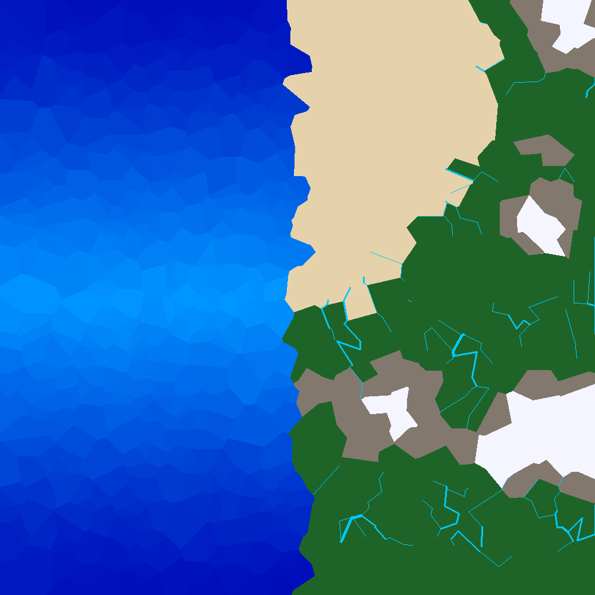
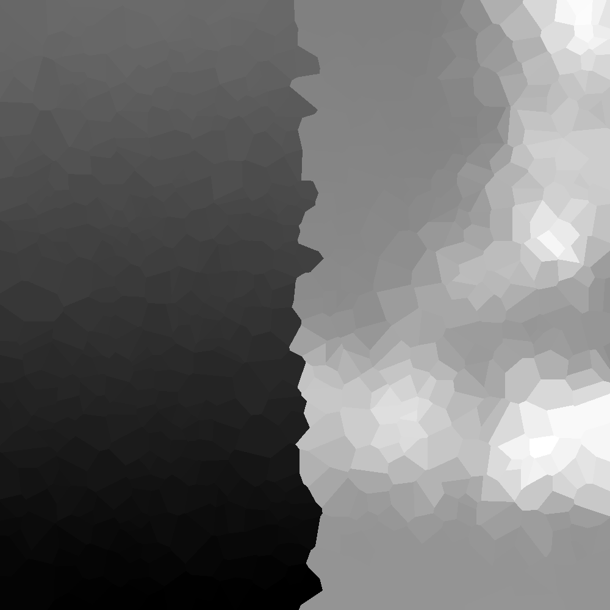

# Procedural Terrain Generator

A C++ procedural terrain generation engine using Voronoi diagrams, tectonic simulation, and fluvial erosion to create realistic maps.

| Biome Map | Normalized Heightmap |
| :---: | :---: |
|  |  |

## Features

- **Voronoi-Based Graph System**: Uses `jc_voronoi` to generate a dual-graph structure (Centers, Corners, Edges) for efficient spatial simulation.
- **Tectonic Simulation**:
  - Plate initialization and elevation smoothing.
  - Mountain range building through plate convergence simulation.
  - Elevation normalization for consistent peak heights.
- **Hydrological Simulation**:
  - Fluvial erosion through downslope calculation.
  - River simulation with realistic branching and accumulation.
  - Moisture and climate calculation based on elevation and water proximity.
- **Biome Rendering**:
  - Dynamic biome shading (Tundra, Desert, Grasslands, Jungle, etc.).
  - Realistic water depth shading.
  - Variable-thickness river rendering using Bresenham's algorithm with a circular brush.
- **Grayscale Heightmap**: Exports a dedicated black-and-white elevation map.
- **Lightweight IO**: Exports results to PPM format for easy viewing.

## Getting Started

### Prerequisites

- A C++11 compatible compiler (e.g., GCC, Clang, MinGW).
- CMake (3.10 or higher).

### Building the Project

```powershell
# Create a build folder to keep your root clean
mkdir build
cd build

# Tell CMake to generate the Makefiles
cmake -G "MinGW Makefiles" ..

# Compile the project
make
```

### Running

Execute the generated binary:

```powershell
./terrain_gen
```

This will generate a `voronoi_map.ppm` in the root directory.

## Project Structure

- `include/terrain/Core/`: Base types like `Vector2`.
- `include/terrain/Map/`: Voronoi graph definitions and generator logic.
- `include/terrain/Simulation/`: Tectonic and Erosion simulation logic.
- `include/terrain/IO/`: Image export utilities.
- `third_party/`: Header-only libraries (`jc_voronoi.h`, `stb_image_write.h`).

## Acknowledgments

- [jc_voronoi](https://github.com/JCash/voronoi) for the core Voronoi generation.
- Based on the principles of polygonal map generation.
